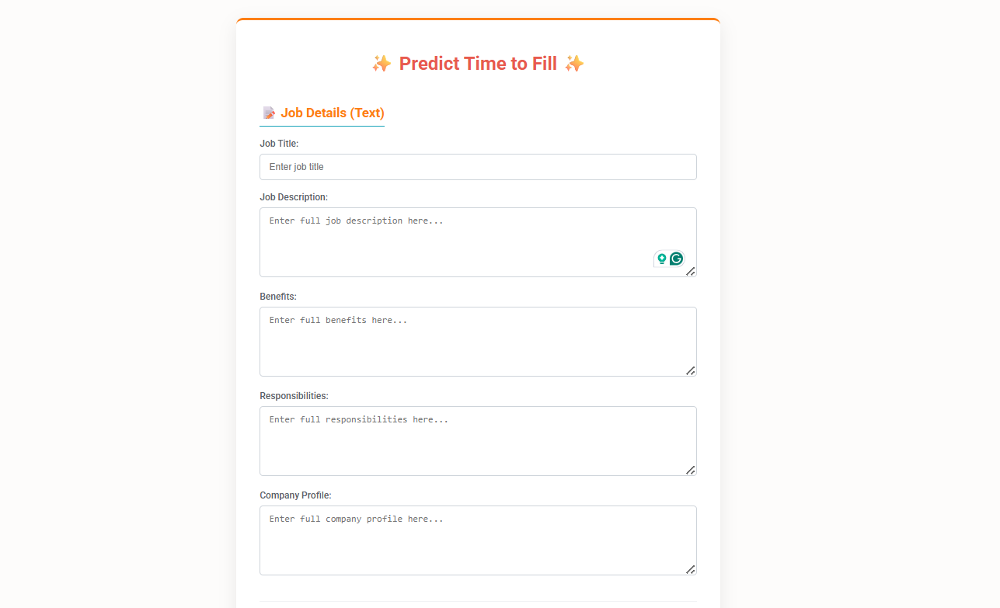
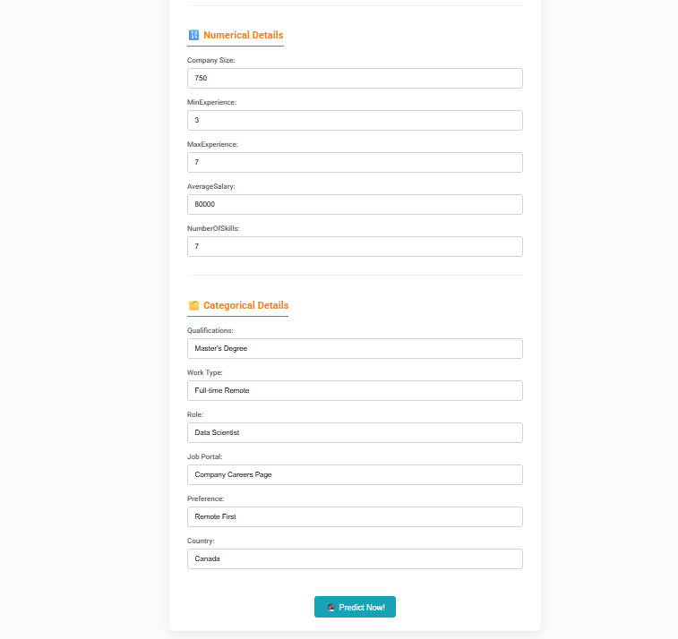

# Job Requisition Time-to-Fill Forecasting Model

This project aims to develop a machine learning model to predict the time (in days) it will take to fill an open job requisition. The prediction is made based on job-specific details provided at the time of requisition creation. The model is served via a Flask web application.

## Project Workflow

The project follows this general workflow:

1.  **Data Acquisition**: Raw data is sourced from two Kaggle datasets using a provided script (`download_kaggle_datasets.py`).
    *   `rabieelkharoua/predicting-hiring-decisions-in-recruitment-data`
    *   `ravindrasinghrana/job-description-dataset`
2.  **Data Preprocessing & Feature Engineering**:
    *   The Jupyter notebook (`notebooks/00_initial_data_load_and_eda.ipynb`) is used for initial data loading, exploratory data analysis (EDA), data cleaning, and feature engineering from the raw Kaggle datasets. This step produces an `X_features.csv` file (`data/processed/X_features.csv`) containing the features for model training.
    *   Engineered features include word counts for fields like Job Title, Job Description, Benefits, Responsibilities, and Company Profile.
3.  **Target Variable Generation**:
    *   The target variable, `TimeToFill_days`, is prepared and stored as `y_target.csv` (`data/processed_v2/y_target.csv`).
4.  **Model Training**:
    *   The `src/train_lgbm_model.py` script trains a LightGBM regression model.
    *   It uses `X_features.csv` (features) and `y_target.csv` (target).
    *   Preprocessing steps within the training script include imputation and scaling for numerical features, and imputation and one-hot encoding for categorical features.
    *   The trained model (`lightgbm_model.joblib`) and the preprocessor (`preprocessor.joblib`) are saved in the `models/` directory.
5.  **Prediction Service**:
    *   `app.py` is a Flask web application that loads the trained model and preprocessor.
    *   It provides a web interface (`templates/index.html`) for users to input job requisition details.
    *   Upon submission, the application preprocesses the input, makes a prediction, and displays the result on `templates/result.html`.

## Features Used by the Model

The model uses the following features, which are input via the web application:

*   **Text Inputs (for Word Count Generation):**
    *   Job Title
    *   Job Description
    *   Benefits
    *   Responsibilities
    *   Company Profile
*   **Numerical Inputs:**
    *   Company Size
    *   MinExperience
    *   MaxExperience
    *   AverageSalary
    *   NumberOfSkills
*   **Categorical Inputs:**
    *   Qualifications
    *   Work Type
    *   Role
    *   Job Portal
    *   Preference
    *   Country

## Technologies Used

*   Python
*   Pandas: For data manipulation and analysis.
*   Scikit-learn: For preprocessing and model evaluation.
*   LightGBM: For the regression model.
*   Flask: For the web application.
*   Joblib: For saving and loading the model and preprocessor.
*   Kagglehub: For downloading datasets from Kaggle.
*   Jupyter Notebook: For EDA and initial data processing.

## Project Structure

```
.
├── data/                    # Data files
│   ├── kaggle_hr_dataset/   # Raw datasets downloaded from Kaggle
│   ├── processed/           # Processed features (X_features.csv)
│   └── processed_v2/        # Target variable (y_target.csv)
├── models/                  # Trained models and preprocessors
│   ├── lightgbm_model.joblib
│   └── preprocessor.joblib
├── notebooks/               # Jupyter notebooks
│   └── 00_initial_data_load_and_eda.ipynb
├── src/                     # Source code
│   ├── apply_rules_to_target.py # Script for target variable preparation
│   ├── train_lgbm_model.py    # Trains the LightGBM model
│   └── train_model.py         # (Likely an alternative or earlier training script)
├── templates/               # HTML templates for the Flask app
│   ├── index.html
│   └── result.html
├── .venv/                   # Virtual environment (recommended)
├── app.py                   # Main Flask application file
├── download_kaggle_datasets.py # Script to download Kaggle datasets
├── requirements.txt         # Python dependencies
└── README.md                # This file
```

## Setup and Usage

### 1. Create a Virtual Environment (Recommended)

```bash
python -m venv .venv
# On Windows
.venv\Scripts\activate
# On macOS/Linux
source .venv/bin/activate
```

### 2. Install Dependencies

```bash
pip install -r requirements.txt
```
You will also need to install `kagglehub` if you haven't already:
```bash
pip install kagglehub
```

### 3. Download Kaggle Datasets

Ensure you are authenticated with Kaggle. Then run the script:
```bash
python download_kaggle_datasets.py
```
This will download datasets into the `data/kaggle_hr_dataset/` directory.

### 4. Prepare Data for Training

*   **Generate Features (`X_features.csv`):**
    Open and run the `notebooks/00_initial_data_load_and_eda.ipynb` Jupyter notebook. This will process the raw data and save `X_features.csv` to `data/processed/`.
*   **Prepare Target Variable (`y_target.csv`):**
    Run the script:
    ```bash
    python src/apply_rules_to_target.py
    ```
    This script processes data to produce `y_target.csv` in `data/processed_v2/`.

### 5. Train the Model

Run the training script:
```bash
python src/train_lgbm_model.py
```
This will train the LightGBM model and save `lightgbm_model.joblib` and `preprocessor.joblib` into the `models/` directory.

### 6. Run the Flask Web Application

```bash
flask --app app run
```
Or, for development mode (with auto-reload):
```bash
python app.py
```
The application will typically be available at `http://127.0.0.1:5000`. Open this URL in your web browser to use the prediction tool.

## Screenshots

Below are some screenshots demonstrating the project:



 